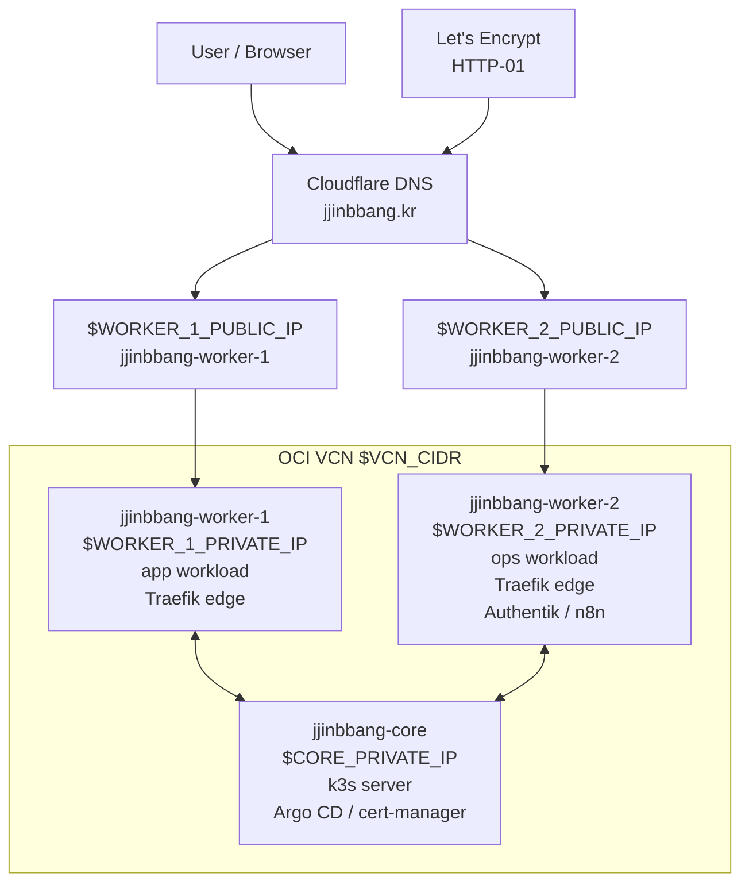
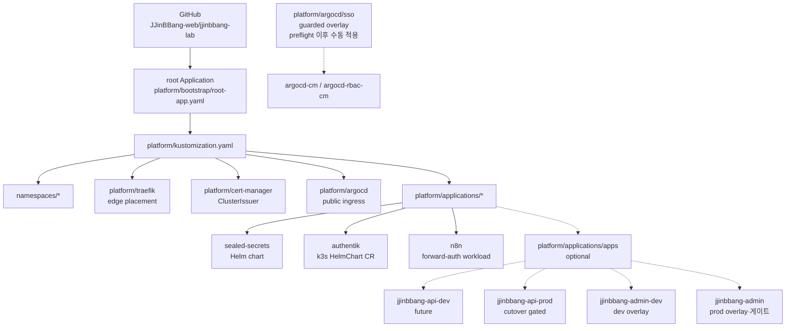
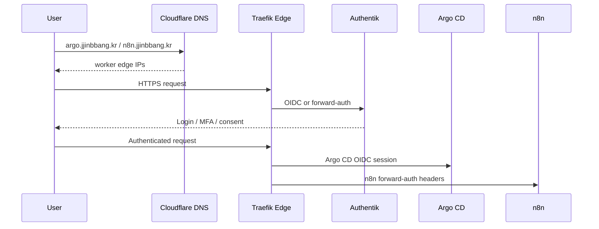

# jjinbbang-lab

찐빵 서비스 배포를 위한 Kubernetes GitOps 랩이다.

이 저장소는 OCI A1 기반 k3s 클러스터의 원하는 상태를 기록하고, Argo CD가 이를
동기화하는 기준 repo로 사용한다. 앱 비즈니스 코드는 여기에 두지 않고 배포
manifest, 운영 도구, 접근 제어, runbook만 둔다.

## 한눈에 보기

| 영역 | 기준 |
| --- | --- |
| GitOps | Argo CD App-of-Apps, `jjinbbang-lab` `main` 기준 동기화 |
| Ingress | k3s packaged Traefik, worker node 2대만 public edge |
| DNS | Cloudflare, 초기 안정화 단계에서는 `DNS only` |
| TLS | cert-manager HTTP-01, Let's Encrypt |
| SSO | Authentik, Argo CD OIDC, n8n forward-auth, 관리자 API OIDC |
| Secret | 원문 secret은 repo 금지, live Secret 이후 Sealed Secrets 이관 |

현재 live cluster는 DNS, TLS, Authentik, n8n, Argo CD SSO, Argo CD root
Application까지 부트스트랩되어 있다. `main` 기준 platform Application은
`Synced/Healthy` 상태로 동기화된다.

## 인프라 설계



| 노드 | Private IP | Public IP | 역할 |
| --- | --- | --- | --- |
| `jjinbbang-core` | `$CORE_PRIVATE_IP` | `$CORE_PUBLIC_IP` | k3s server, Argo CD, cert-manager, Sealed Secrets |
| `jjinbbang-worker-1` | `$WORKER_1_PRIVATE_IP` | `$WORKER_1_PUBLIC_IP` | app workload, Traefik edge |
| `jjinbbang-worker-2` | `$WORKER_2_PRIVATE_IP` | `$WORKER_2_PUBLIC_IP` | ops workload, Traefik edge, Authentik, n8n |

설계 원칙:

- core는 control-plane과 GitOps 도구 중심으로 유지하고 public HTTP/HTTPS edge에서 제외한다.
- worker 두 대만 Traefik edge로 열어 Cloudflare DNS가 바라보게 한다.
- OCI subnet 내부 통신은 k3s control-plane, ServiceLB, pod traffic을 위해 허용한다.
- 운영 도구 접근은 `auth.jjinbbang.kr` SSO를 기준으로 통일한다.

Canonical hostnames:

```text
auth.jjinbbang.kr
argo.jjinbbang.kr
n8n.jjinbbang.kr
dev.admin.jjinbbang.kr
admin.jjinbbang.kr
```

## Argo CD 설계

Argo CD는 root Application 하나가 platform entrypoint를 바라보고, platform
entrypoint가 child Application과 공통 platform resource를 선언하는 구조다.



Argo CD 운영 기준:

- `platform/bootstrap/root-app.yaml`은 GitHub `main`에 올라간 manifest와 로컬 파일이
  일치할 때만 `scripts/apply-root-app.sh`로 적용한다.
- root와 platform child Application은 `selfHeal=true`, `prune=false`로 둔다.
  초기 랩에서는 drift 복구는 허용하지만 삭제성 prune은 수동 판단한다.
- Authentik, n8n 같은 platform workload는 child Application으로 관리한다.
- 앱 배포(`apps/jjinbbang-api`)는 준비된 뒤 `platform/applications/apps`를 별도로
  연결한다. production `api.jjinbbang.kr` cutover는 별도 승인 전까지 막는다.
- Argo CD local admin은 DNS, TLS, Authentik OIDC, Kubernetes Secret이 확인된 뒤
  `platform/argocd/sso` overlay로 끈다.

## 접근 흐름



SSO 기준:

- `auth.jjinbbang.kr`: Authentik 자체 로그인과 admin.
- `argo.jjinbbang.kr`: Argo CD OIDC가 Authentik issuer를 사용한다.
- `n8n.jjinbbang.kr`: Traefik forwardAuth와 Authentik Proxy Provider로 보호한다.
- `jjinbbang-admins`: Argo CD admin, n8n 접근 권한 기준 group.
- `jjinbbang-observers`: Argo CD readonly group.
- `jjinbbang-backoffice-admins`: 찐빵 관리자 API 접근 group.
- `jjinbbang-backoffice-admins-dev`: 관리자 API 개발 환경 접근 group.
- 관리자 개인 계정은 Authentik의 만료되는 일회용 초대로 만들고, MFA 확인 후
  환경별 group을 수동 부여한다. 공용 계정은 비상 복구용으로만 유지한다.

## 저장소 구조

| 경로 | 역할 |
| --- | --- |
| `.github/workflows/validate.yml` | manifest 검증 CI |
| `.github/workflows/update-admin-image.yml` | 검증된 main 이미지를 prod overlay에 즉시 반영 |
| `.github/workflows/reconcile-admin-dev-images.yml` | 매시간 develop 웹/API ARM64 이미지를 dev overlay에 반영 |
| `scripts/update-admin-image.sh` | 관리자 이미지 dispatch payload 검증과 digest-pinned overlay 갱신 공유 로직 |
| `platform/bootstrap` | 최초 root Argo CD Application |
| `platform/applications` | Argo CD가 관리할 platform Application 목록 |
| `platform/argocd` | Argo CD public ingress와 SSO 전환용 설정 |
| `platform/authentik` | k3s HelmChart 기반 Authentik 설치, public ingress, SSO bootstrap Job |
| `platform/cert-manager` | Let's Encrypt issuer |
| `platform/traefik` | k3s packaged Traefik edge 설정 |
| `platform/workloads/n8n` | n8n workload와 Authentik forward-auth 설정 |
| `apps` | 찐빵 서비스 앱 manifest와 dev/prod overlay를 두는 위치 |
| `platform/secrets` | repo에 넣지 않는 live Secret 계약 문서 |
| `docs/runbooks` | bootstrap, DNS, SSO 운영 절차 |

관리자 웹/API의 SSO, 환경별 Secret, 이미지 dispatch와 활성화 절차는
`docs/runbooks/admin-sso-delivery.md`를 따른다.

`main` 이미지 dispatch는 검증 후 prod overlay에 즉시 반영한다. dev overlay는
매시간 웹과 API의 `develop` HEAD에 대응하는 ARM64 image digest로 조정한다.
두 workflow는 같은 concurrency group을 사용하고 대상 overlay 파일만 커밋한다.

## Bootstrap 절차

1. `.env.example`을 참고해 로컬 환경 변수를 준비한다.
2. `docs/runbooks/bootstrap.md` 순서대로 클러스터 상태를 확인한다.
3. live secret을 만든 뒤 Authentik bootstrap Job을 적용한다.
4. Cloudflare에서 `auth`, `argo`, `n8n` DNS를 worker edge IP 두 개로 둔다.
5. `DNS_SERVER=1.1.1.1 ./scripts/post-dns-readiness.sh`로 DNS, TLS, endpoint,
   Argo CD SSO preflight를 확인한다.
6. GitHub `main`에 root manifest가 올라간 뒤 `./scripts/apply-root-app.sh --check`
   및 `./scripts/apply-root-app.sh`를 실행한다.
7. 적용 후 `./scripts/status.sh`로 DNS, certificate, Argo CD Application, SSO
   preflight를 확인한다.

## 현재 운영 상태

2026-06-02 기준 확인된 live 상태:

| 항목 | 상태 |
| --- | --- |
| Cloudflare delegation | `anderson.ns.cloudflare.com`, `love.ns.cloudflare.com` |
| Public records | `auth`, `argo`, `n8n` -> worker edge 2대 |
| Edge ports | worker 2대 80/443 open, core 80/443 closed |
| Certificates | `argocd`, `authentik`, `n8n` public TLS `Ready=True` |
| Argo CD Applications | `jjinbbang-platform`, `authentik`, `n8n`, `sealed-secrets` `Synced/Healthy` |
| Authentik | public login, Argo CD OIDC issuer, n8n proxy provider 구성 |
| n8n | owner bootstrap 완료, Authentik forward-auth 보호, SSO header 기반 auth cookie 발급 확인 |

운영 중 확인은 아래 명령을 기준으로 한다.

```bash
DNS_SERVER=1.1.1.1 ./scripts/status.sh
```

## 운영 스크립트

| 스크립트 | 용도 |
| --- | --- |
| `scripts/status.sh` | repo, DNS, cluster, certificate, guarded gate 상태를 한 번에 확인 |
| `scripts/validate-manifests.sh` | YAML, shell, Kustomize build 검증 |
| `scripts/check-dns.sh` | `auth/argo/n8n` DNS와 worker edge 80/443 확인 |
| `scripts/cloudflare-upsert-dns.sh` | Cloudflare A record 생성/갱신 |
| `scripts/route53-upsert-dns.sh` | Route53 위임 상태에서 임시 A record 생성/갱신 |
| `scripts/patch-coredns-public-forward.sh` | CoreDNS upstream을 public resolver로 전환/확인/복구 |
| `scripts/post-dns-readiness.sh` | DNS 이후 TLS, public endpoint, Argo CD SSO preflight 확인 |
| `scripts/apply-root-app.sh` | GitHub `main` root manifest 확인 후 root Application 적용 |
| `scripts/apply-argocd-sso.sh` | DNS/TLS/OIDC 확인 후 Argo CD SSO overlay 적용 |
| `scripts/bootstrap-n8n-owner.sh` | Authentik email과 맞춘 n8n owner bootstrap 및 forward-auth 검증 |

## Git 컨벤션

브랜치와 커밋은 Git Flow 계열을 기본으로 하되, 이 repo는 초기 랩 안정화 단계이므로
삭제성 작업과 production cutover는 별도 승인 후 진행한다.

### Branch

| Prefix | 용도 | 기준 |
| --- | --- | --- |
| `init/*` | repo, platform, 서비스 최초 초기화 | 초기 bootstrap 작업 |
| `feat/*` | 기능 추가 | `main` 기준 분기 |
| `fix/*` | 일반 버그 수정 | `main` 기준 분기 |
| `hotfix/*` | 운영 긴급 수정 | `main` 기준 분기 |
| `release/*` | 릴리즈 준비 | `main` 안정화 후 |
| `docs/*` | 문서만 변경 | 코드/manifest 변경 없음 |
| `chore/*` | 관리성 작업 | 동작 변경 최소 |

현재 기본 승격 흐름은 `작업 브랜치 -> main`이다. `hotfix/*`는 운영 장애처럼
일반 승격 흐름을 기다릴 수 없을 때만 사용한다.

### Commit Message

```text
<gitmoji> <Type>[ticket?]: <message>
```

티켓이 없으면 bracket을 통째로 생략한다.

```text
🎉 Init: 찐빵 랩 저장소 초기화
🧱 Infra[JJIN-123]: Traefik edge ingress 구성
🚑️ Hotfix[JJIN-911]: 운영 API 인증서 장애 복구
```

Type은 PascalCase로 쓴다.

| Type | 용도 |
| --- | --- |
| `Init` | repo, 서비스, infra 최초 초기화 |
| `Feat` | 기능 추가 |
| `Fix` | 일반 버그 수정 |
| `Hotfix` | 운영 장애나 긴급 수정 |
| `Docs` | 문서 추가/수정 |
| `Infra` | Kubernetes, DNS, Cloudflare, OCI, Argo CD, Traefik 등 인프라 |
| `CI` | GitHub Actions, 빌드/검증 파이프라인 |
| `Test` | 테스트나 검증 추가 |
| `Refactor` | 동작 변경 없는 구조 개선 |
| `Perf` | 성능 개선 |
| `Style` | 포맷, lint, 스타일만 변경 |
| `Build` | 빌드 시스템, 이미지, 패키징 |
| `Chore` | 관리성 설정/스크립트/잡무 |
| `Release` | 릴리즈/버전 태그 준비 |
| `Revert` | 변경 되돌리기 |
| `Security` | 보안, 권한, 취약점 대응 |

### Gitmoji

| Gitmoji | Shortcode | 기본 의도 |
| --- | --- | --- |
| 🎉 | `:tada:` | 프로젝트 시작 |
| ✨ | `:sparkles:` | 기능 추가 |
| 🐛 | `:bug:` | 버그 수정 |
| 🚑️ | `:ambulance:` | 긴급 hotfix |
| 📝 | `:memo:` | 문서 |
| 🧱 | `:bricks:` | 인프라 |
| 🔧 | `:wrench:` | 설정 |
| 🔨 | `:hammer:` | 개발/운영 스크립트 |
| 💚 | `:green_heart:` | CI 수정 |
| ✅ | `:white_check_mark:` | 테스트/검증 |
| ♻️ | `:recycle:` | 리팩터링 |
| ⚡️ | `:zap:` | 성능 개선 |
| 🎨 | `:art:` | 구조/포맷 개선 |
| 🚀 | `:rocket:` | 배포 |
| 🔒️ | `:lock:` | 보안/개인정보 |
| 🔐 | `:closed_lock_with_key:` | secret 관련 변경 |
| 🛂 | `:passport_control:` | 인증/권한/role |
| 🔖 | `:bookmark:` | 릴리즈/버전 태그 |
| ⏪️ | `:rewind:` | 되돌리기 |

한 커밋에서 여러 의도가 섞이면 커밋을 나눈다. Gitmoji는 커밋의 주된 의도 하나만
표현한다.

## 직접 적용 금지 원칙

- secret 원문, kubeconfig, SSH private key, Cloudflare token은 커밋하지 않는다.
- `git commit`, `git push`, `git merge`는 사용자 승인 후에만 실행한다.
- Argo CD가 읽을 repo 기준 상태와 수동 bootstrap 절차를 분리해서 기록한다.
- production DNS, `api.jjinbbang.kr`, Argo CD prune 전환은 별도 승인 없이는 변경하지 않는다.

## 참고 기준

- [GitHub README 문서](https://docs.github.com/en/repositories/managing-your-repositorys-settings-and-features/customizing-your-repository/about-readmes)
- [GitHub Mermaid 문서](https://docs.github.com/en/get-started/writing-on-github/working-with-advanced-formatting/creating-diagrams)
- [Argo CD Declarative Setup](https://argo-cd.readthedocs.io/en/latest/operator-manual/declarative-setup/)
- [Gitmoji Specification](https://gitmoji.dev/specification)
